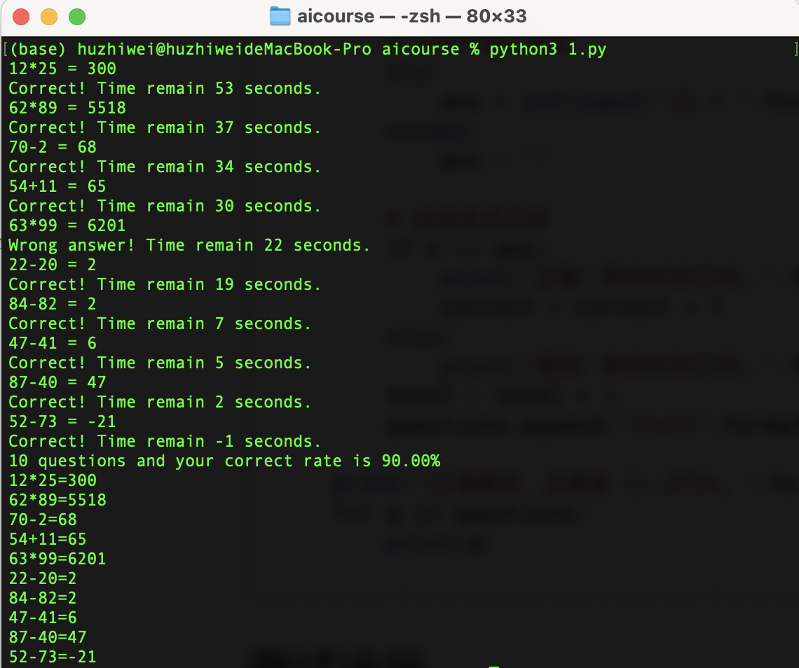

# 1 minute math

## Requirements

1. Run the code in console using command line.
2. It'll run for 1 minute.
3. For every time it'll show 2 random numbers and random arithmetic operations such as add, subtract, multiply and divide. If the operation is divide then the divisor can not be 0.
4. It'll judge if your answer is correct or not, then show next question.
5. When time is up it'll show how many questions you answered and show the correct rate for total questions.

## What will we practice in this project?

- format print
- while loop
- if condition
- list
- exception handle
- function
- time package
- random package

## A reference code

```python
import time
import random


def get_divisor(n):
    '''
    Get a random divisor of n.
    :param n: The number
    :return: a divisor of n
    '''
    l = []
    for i in range(1, n + 1):
        if n % i == 0:
            l.append(i)
    return random.choice(l)


if __name__ =='__main__':
    ops = ['+', '-', '*', '/']
    start_time = time.time()
    total = 0
    correct = 0
    questions = []
    # while seconds is less than 60
    while time.time() - start_time <= 60:
        a = random.randint(1, 99)
        op = random.choice(ops)
        if op == '/':
            # if op is '/' then b is a divisor of a
            b = get_divisor(a)
        else:
            b = random.randint(1, 99)
        # Get the correct answer
        a_op_b = '{}{}{}'.format(a, op, b)
        c = int(eval(a_op_b))

        # Let user input answer
        try:
            ans = int(input('{} = '.format(a_op_b)))
        except:
            ans = ''
		
        # To check if correct or not
        if time.time() - start_time <= 60: 
            if c == ans:
                print('Correct! Time remain {} seconds.'.format(int(60 - (time.time() - start_time))))
                correct = correct + 1
            else:
                print('Wrong answer! Time remain {} seconds.'.format(int(60 - (time.time() - start_time))))
            total = total + 1
            questions.append('{}={}'.format(a_op_b, ans))

    print('{} questions and your correct rate is {:.2f}%'.format(total, correct / total * 100))
    for q in questions:
        print(q)

```

## Run the demo

Please save the Python as 1.py and run it in console：

```
python 1.py
```



----

# 1分钟数学运算

## 项目需求

- 直接在控制台使用命令行运行
- 程序运行之后倒计时1分钟之后结束
- 随机出100以内的2个整数加减乘除运算题目（除法确保能够除尽，但除数不能为0）
- 每出一道题目，由玩家给出答案，然后程序判断对错，接着出下一题，并且显示剩余时间
- 1分钟时间结束，显示总题数和正确率（正确率精确到小数点后2位），并将之前的题目和答案显示出来

## 项目练习

- 格式化字符串输出
- 循环
- 条件判断
- 列表
- 异常处理
- 自定义函数
- 时间工具包
- 随机工具包

## 项目参考代码

```python
import time
import random


def get_divisor(n):
    '''
    随机获得一个数n的整数除数。
    :param n: 一个整数
    :return: 一个数n的整数除数
    '''
    l = []
    for i in range(1, n + 1):
        if n % i == 0:
            l.append(i)
    return random.choice(l)


if __name__ =='__main__':
    ops = ['+', '-', '*', '/']
    start_time = time.time()
    total = 0
    correct = 0
    questions = []
    while time.time() - start_time <= 60:
        a = random.randint(1, 99)
        op = random.choice(ops)
        if op == '/':
            # 如果是除法，b为a的一个随机整数除数
            b = get_divisor(a)
        else:
            b = random.randint(1, 99)
        # 正确答案
        a_op_b = '{}{}{}'.format(a, op, b)
        c = int(eval(a_op_b))

        # 让用户输入答案
        try:
            ans = int(input('{} = '.format(a_op_b)))
        except:
            ans = ''

        # 检查是否正确
        if time.time() - start_time <= 60:
            if c == ans:
                print('正确！剩余时间{}秒。'.format(int(60 - (time.time() - start_time))))
                correct = correct + 1
            else:
                print('错误！剩余时间{}秒。'.format(int(60 - (time.time() - start_time))))
            total = total + 1
            questions.append('{}={}'.format(a_op_b, ans))

    print('{}道题目，正确率 {:.2f}%。'.format(total, correct / total * 100))
    for q in questions:
        print(q)

```

## 测试运行

将代码保存为1.py，然后在控制台运行：

```
python 1.py
```

