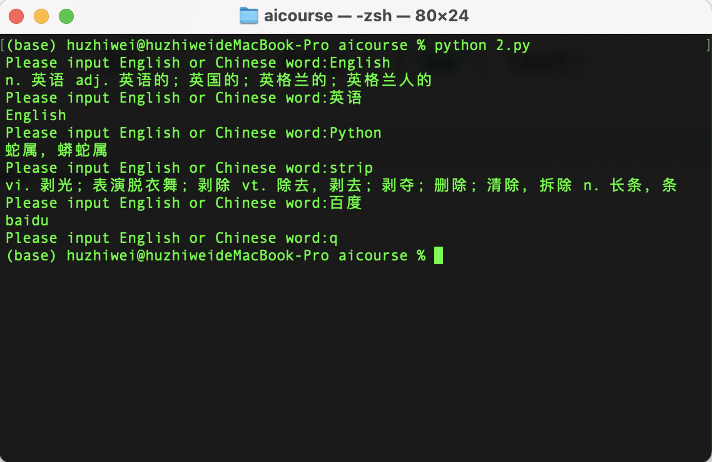
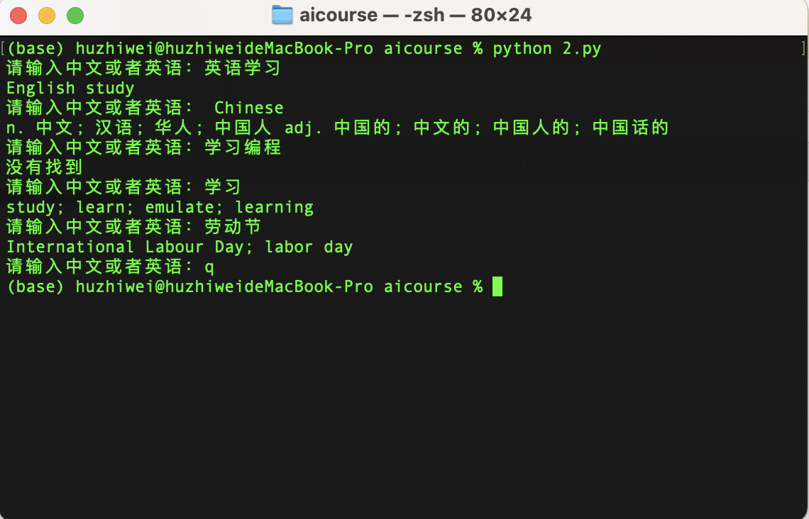

# English Chinese Translation

## Requirements

1. Run the code in console using command line.
2. It'll ask you to input English or Chinese words or sentence. Then it'll print the related translation text.
3. If you input 'q' it'll stop to ask then quit the program.

## What will we practice in this project?

- while loop
- input text
- if conditions
- http post request
- dictionary
- requests package (need to install it by `pip install requests`)

## A reference code

```python
import requests

url = 'https://fanyi.baidu.com/sug'

while True:
    text = input('Please input English or Chinese word:').strip()
    if text == 'q':
        break

    data = {'kw': text}

    resp = requests.post(url, data)

    found = False
    if resp.status_code == 200:
        data = resp.json()
        if data['errno'] == 0:
            ds = data['data']
            for kv in ds:
                if kv['k'] == text:
                    found = True
                    print(kv['v'])
            if not found:
                print('Not found')
        else:
            print(data)
    else:
        print(resp.content)

```

## Run the demo

Please save the Python as 2.py and run it in console：




# 中英文翻译

## 项目需求

1. 在命令行窗口运行
2. 当程序运行时，会要求我们输入中文或者英文单词或者句子，然后程序会自动翻译成对应的英语或者中文
3. 当输入q字母，程序不再询问并结束

## Python编程知识点

- while循环
- 用户输入字符串
- 条件判断
- 字典数据
- http post请求
- requests 模块 (需要使用`pip install requests`安装)

## 参考代码

```python
import requests

url = 'https://fanyi.baidu.com/sug'

while True:
    text = input('请输入中文或者英语：').strip()
    if text == 'q':
        break

    data = {'kw': text}

    resp = requests.post(url, data)

    found = False
    if resp.status_code == 200:
        data = resp.json()
        if data['errno'] == 0:
            ds = data['data']
            for kv in ds:
                if kv['k'] == text:
                    found = True
                    print(kv['v'])
            if not found:
                print('没有找到')
        else:
            print(data)
    else:
        print(resp.content)

```

## 运行测试
将代码保存为2.py，然后在控制台运行：

```
python 2.py
```



