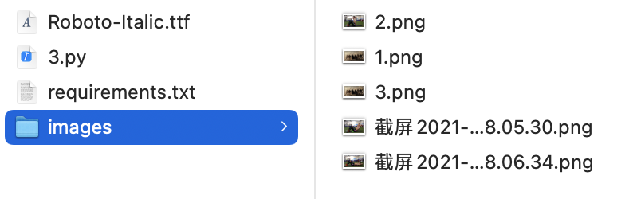
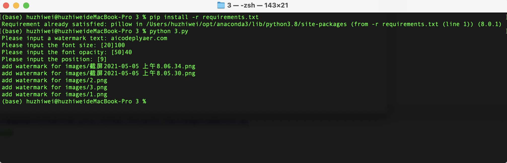
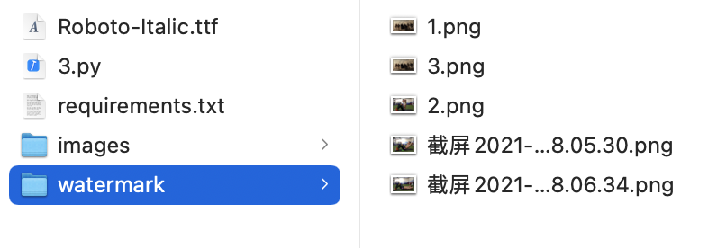

# Add text watermark on pictures

## Requirements

1. Run the code in console using command line.
2. It'll ask you what's the text you want to add as watermark, and the text size, transparency and position. Please use 20, 50% and bottom right as the default values.
3. It'll add the text watermark on every png pictures in the 'images' dirtionary of the current path, and save these pictures into 'watermark' dirtionary.

## What will we practice in this project?

- for loop
- input text
- if conditions
- functions
- tuple
- Open/save files
- Image RGBA conception
- os package
- PIL package (need to install by `pip install pillow`)

## A reference code

```python
import os

from PIL import Image, ImageDraw, ImageFont


def get_position(image_width, image_height, text_width, text_height, position_id=9, margin=10):
    '''
    Get the position of the text by the position_id
    1: top left, 2: top center, 3: top right
    4: middle left, 5: middle center, 6: middle right
    7: bottom left, 8: bottom center, 9: bottom right
    :param image_width: image width
    :param image_height: image height
    :param text_width: text width
    :param text_height: text height
    :param position_id: position_id
    :param margin: the text position margin value to the image
    :return: text position tuple
    '''
    margin = 10
    if position_id == 1:
        return (margin, margin)
    elif position_id == 2:
        return (image_width // 2 - text_width // 2, margin)
    elif position_id == 3:
        return (image_width - text_width - margin, margin)
    elif position_id == 4:
        return (margin, image_height // 2 - text_height // 2)
    elif position_id == 5:
        return (image_width // 2 - text_width // 2, image_height // 2 - text_height // 2)
    elif position_id == 6:
        return (image_width - text_width - margin, image_height // 2 - text_height // 2)
    elif position_id == 7:
        return (margin, image_height - text_height - margin)
    elif position_id == 8:
        return (image_width // 2 - text_width // 2, image_height - text_height - margin)
    elif position_id == 9:
        return (image_width - text_width - margin, image_height - text_height - margin)


def add_watermark(filename, text, font_name='Roboto-Italic.ttf', font_size=20, font_opacity=50, position_id=9):
    '''
    Add watermark function
    :param filename: origin image filename
    :param text: watermark text
    :param font_name: Roboto-Italic.ttf, you can use your font, please make sure your program can find it
    :param font_size: font size, default is 20
    :param font_opacity: font opacity, default is 50
    :param position_id: position id, defalut is 9 (bottom right)
    :return: 
    '''
    # get an image
    with Image.open(filename).convert("RGBA") as base:
        # make a blank image for the text, initialized to transparent text color
        txt = Image.new("RGBA", base.size, (255, 255, 255, 0))

        # get a font
        fnt = ImageFont.truetype(font_name, font_size)
        # get a drawing context
        d = ImageDraw.Draw(txt)
        # get the text widht and height
        text_width, text_height = d.textsize(text, font=fnt)
        # get the text position of the image
        pos = get_position(base.size[0], base.size[1], text_width, text_height, position_id=position_id)
        # draw text with opacity
        d.text(pos, text, font=fnt, fill=(255, 255, 255, 256 * font_opacity // 100))
        out = Image.alpha_composite(base, txt)

        # save the image file
        out_filename = 'watermark/{}'.format(os.path.basename(filename))
        if not os.path.exists('watermark'):
            os.makedirs('watermark')
        out.save(out_filename, 'PNG')


if __name__ == '__main__':
    text = input('Please input a watermark text: ').strip()
    font_size = int(input('Please input the font size: [20]') or '20')
    font_opacity = int(input('Please input the font opacity: [50]') or '50')
    # 1: top left, 2: top center, 3: top right
    # 4: middle left, 5: middle center, 6: middle right
    # 7: bottom left, 8: bottom center, 9: bottom right
    position_id = int(input('Please input the position: [9]') or '9')

    for f in os.listdir('images'):
        if f.endswith('.png'):
            filename = 'images/{}'.format(f)
            print('add watermark for {}'.format(filename))
            add_watermark(filename=filename, text=text, font_size=font_size, font_opacity=font_opacity,
                          position_id=position_id)

```

## Run the demo

- make sure you have a `image` dirtionary and put some `png` files in this dirtionary
- use `pip install requirements.txt` to install packages
- run it in console

```shell
python 3.py
```

- it'll add watermark on every picture in `images` dirtionary and save them to `watermark` dirtionary.








# 给图片增加文字水印

## 项目需求

1. 在命令行窗口运行；
2. 程序运行时，会提示输入水印的文字，以及水印文字大小，透明度和位置，文字大小默认值为20，透明度默认为50%，位置默认为右下角。使用数字1-9分别代表左上、中上、右上、中左、正中、中右、下左、下中、下右；
3. 程序会给当前目录下的images目录中所有png文件增加水印，并保存到watermark目录中。

## Python编程知识点

- for循环
- 用户输入字符串
- 条件判断
- 自定义函数
- 元组
- 打开、保存图片文件
- 图片RGBA概念
- os模块
- PIL 模块 (需要使用`pip install pillow`安装)

## 参考代码

```python
import os

from PIL import Image, ImageDraw, ImageFont


def get_position(image_width, image_height, text_width, text_height, position_id=9, margin=10):
    '''
    获取文字位置，position_id
    1: 左上, 2: 中上, 3: 右上
    4: 中左, 5: 正中, 6: 中右
    7: 左下, 8: 下中, 9: 右下
    :param image_width: 图片宽度
    :param image_height: 图片高度
    :param text_width: 文字宽度
    :param text_height: 文字高度
    :param position_id: 位置ID，1-9，默认是9（右下）
    :param margin: 边距值，默认为10px
    :return: 文字位置的(x, y)元组
    '''
    margin = 10
    if position_id == 1:
        return (margin, margin)
    elif position_id == 2:
        return (image_width // 2 - text_width // 2, margin)
    elif position_id == 3:
        return (image_width - text_width - margin, margin)
    elif position_id == 4:
        return (margin, image_height // 2 - text_height // 2)
    elif position_id == 5:
        return (image_width // 2 - text_width // 2, image_height // 2 - text_height // 2)
    elif position_id == 6:
        return (image_width - text_width - margin, image_height // 2 - text_height // 2)
    elif position_id == 7:
        return (margin, image_height - text_height - margin)
    elif position_id == 8:
        return (image_width // 2 - text_width // 2, image_height - text_height - margin)
    elif position_id == 9:
        return (image_width - text_width - margin, image_height - text_height - margin)


def add_watermark(filename, text, font_name='Roboto-Italic.ttf', font_size=20, font_opacity=50, position_id=9):
    '''
    增加水印
    :param filename: 要加水印的文件(dir/file.png)
    :param text: 水印文字
    :param font_name: 默认为Roboto-Italic.ttf字体
                      你也可以使用自己的字体，确保代码能够找到这个字体文件（在当前目录或者系统字体目录中）
    :param font_size: 字体大小，默认值为20px
    :param font_opacity: 透明度，默认为50%
    :param position_id: 位置ID，1-9，默认是9（右下）
    :return: 
    '''
    # 打开原图片文件
    with Image.open(filename).convert("RGBA") as base:
        # 创建一个新的透明画面，大小和原图片一样
        txt = Image.new("RGBA", base.size, (255, 255, 255, 0))
        # 使用指定的字体
        fnt = ImageFont.truetype(font_name, font_size)
        # 准备“画”文字
        d = ImageDraw.Draw(txt)
        # 得到文字的宽度和高度
        text_width, text_height = d.textsize(text, font=fnt)
        # 得到文字的位置
        pos = get_position(base.size[0], base.size[1], text_width, text_height, position_id=position_id)
        # 将文字“画”到画布上
        d.text(pos, text, font=fnt, fill=(255, 255, 255, 256 * font_opacity // 100))
        # 将画布和原图片合并
        out = Image.alpha_composite(base, txt)

        # 保存图片文件
        out_filename = 'watermark/{}'.format(os.path.basename(filename))
        if not os.path.exists('watermark'):
            os.makedirs('watermark')
        out.save(out_filename, 'PNG')


if __name__ == '__main__':
    text = input('请输入水印文字: ').strip()
    font_size = int(input('请输入文字大小: [20]') or '20')
    font_opacity = int(input('请输入文字透明度: [50]') or '50')
    # 1: 左上, 2: 中上, 3: 右上
    # 4: 中左, 5: 正中, 6: 中右
    # 7: 左下, 8: 下中, 9: 右下
    position_id = int(input('请输入水印位置: [9]') or '9')

    for f in os.listdir('images'):
        if f.endswith('.png'):
            filename = 'images/{}'.format(f)
            print('给{}增加水印'.format(filename))
            add_watermark(filename=filename, text=text, font_size=font_size, font_opacity=font_opacity,
                          position_id=position_id)


```

## 运行测试

- 将需要加水印的图片放到当前目录的`images`目录中
- 使用 `pip install requirements.txt`来安装工具包
- 运行

```shell
python 3.py
```

- 程序会将`images`目录中所有png图片增加水印并保存到`watermark`目录中


> 注意，如果要增加汉字水印，请使用一个汉字字体，使用Roboto-Italic.ttf无法显示汉字。

