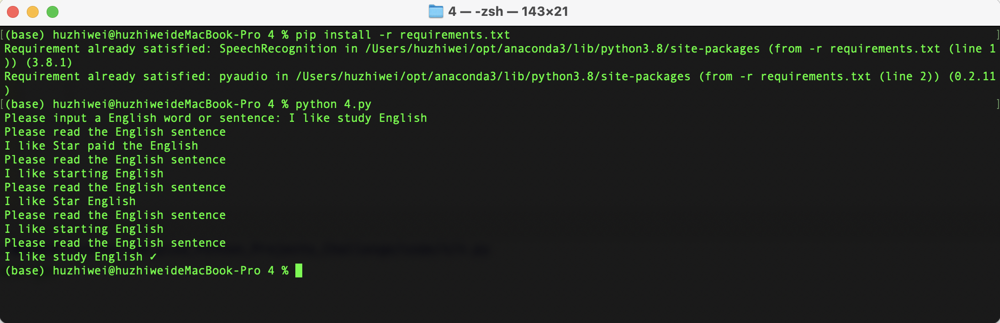
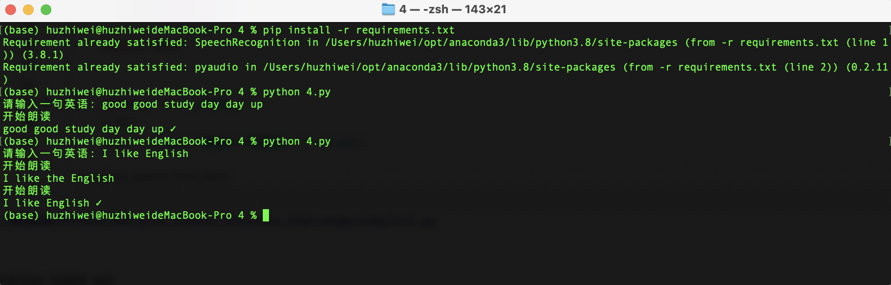

# Check your English speech

## Requirements

1. Run the code in console using command line.
2. It'll let you input a English word or sentence, then it'll let you speak it.
3. It'll record your voice using mic and check if you speak correctly. If not it'll ask you speak it again until you speak it correctly.

## What will we practice in this project?

- for loop
- input text
- Text lower case
- if conditions
- functions
- exception handle
- SpeechRecognition package (need to install by `pip install SpeechRecognition`) it support these speech recognitions: 
    - `recognize_bing()`: [Microsoft Bing Speech](https://azure.microsoft.com/en-us/services/cognitive-services/speech/)
    - `recognize_google()`: [Google Web Speech API](https://w3c.github.io/speech-api/speechapi.html)
    - `recognize_google_cloud()`: [Google Cloud Speech](https://cloud.google.com/speech/) - requires installation of the google-cloud-speech package
    - `recognize_houndify()`: [Houndify](https://www.houndify.com/) by SoundHound
    - `recognize_ibm()`: [IBM Speech to Text](https://www.ibm.com/watson/services/speech-to-text/)
    - `recognize_sphinx()`: [CMU Sphinx](https://cmusphinx.github.io/) - requires installing PocketSphinx
    - `recognize_wit()`: [Wit.ai](https://wit.ai/)
- pyaudio package (need to install by `pip install pyaudio`)

## A reference code

```python
import speech_recognition as sr


def recognize_speech_from_mic(recognizer, microphone):
    '''
    Transcribe speech from recorded from `microphone`.
    :param recognizer: 
    :param microphone: 
    :return: `None` if speech could not be transcribed, otherwise a string containing the transcribed text
    '''
    print('Please read the English sentence')
    # adjust the recognizer sensitivity to ambient noise and record audio
    # from the microphone
    with microphone as source:
        recognizer.adjust_for_ambient_noise(source)
        audio = recognizer.listen(source)

    # try recognizing the speech in the recording
    try:
        text = recognizer.recognize_google(audio)
    except Exception as e:
        print(e)
        text = None

    return text


if __name__ == '__main__':
    # input a English word or sentence
    text = input('Please input a English word or sentence: ').strip()

    # create recognizer and mic instances
    recognizer = sr.Recognizer()
    microphone = sr.Microphone()

    # get your speech text
    speech_text = recognize_speech_from_mic(recognizer, microphone)

    while speech_text != None and text.lower() != speech_text.lower():
        print(speech_text)
        # get your speech text
        speech_text = recognize_speech_from_mic(recognizer, microphone)

    if speech_text:
        print('{} {}'.format(speech_text, '✓'))
    else:
        print('Please try the speech recognization service later or change another one.')

```

## Run the demo

- use `pip install requirements.txt` to install packages: `pyaudio` and `SpeechRecognition`
- run it in console

```shell
python 4.py
```



----


# 检测英语口语

## 项目需求

1. 在命令行窗口运行；
2. 程序运行时，会让你输入一句英语，然后你需要对着麦克风读出这句英语；
3. 程序会判断你读的对不对，如果不对会让你重读，直到读对为止。

## Python编程知识点

- while循环
- 用户输入字符串
- 字符串小写
- 条件判断
- 自定义函数
- 异常处理
- SpeechRecognition 模块 (安装： `pip install SpeechRecognition`) it support these speech recognitions: 
    - `recognize_bing()`: [Microsoft Bing Speech](https://azure.microsoft.com/en-us/services/cognitive-services/speech/)
    - `recognize_google()`: [Google Web Speech API](https://w3c.github.io/speech-api/speechapi.html)
    - `recognize_google_cloud()`: [Google Cloud Speech](https://cloud.google.com/speech/) - 需要安装`google-cloud-speech`模块
    - `recognize_houndify()`: [Houndify](https://www.houndify.com/) by SoundHound
    - `recognize_ibm()`: [IBM Speech to Text](https://www.ibm.com/watson/services/speech-to-text/)
    - `recognize_sphinx()`: [CMU Sphinx](https://cmusphinx.github.io/) - 需要安装`PocketSphinx`模块
    - `recognize_wit()`: [Wit.ai](https://wit.ai/)
- pyaudio 模块 (安装： `pip install pyaudio`)

## 参考代码

```python
import speech_recognition as sr


def recognize_speech_from_mic(recognizer, microphone):
    '''
    麦克风录音并转文字 `microphone`.
    :param recognizer: 语音识别器
    :param microphone: 麦克风
    :return: `None` 如果识别失败返回None，否则返回语音文字
    '''
    print('开始朗读')
    # 录音并去除噪音
    with microphone as source:
        recognizer.adjust_for_ambient_noise(source)
        audio = recognizer.listen(source)

    # 调用语音识别，亲测微软bing国内可用，国外建议使用google
    try:
        text = recognizer.recognize_google(audio)
    except Exception as e:
        print(e)
        text = None

    return text


if __name__ == '__main__':
    # 输入
    text = input('请输入一句英语: ').strip()

    # 创建语音识别器和麦克风
    recognizer = sr.Recognizer()
    microphone = sr.Microphone()

    # 录音并获取文字
    speech_text = recognize_speech_from_mic(recognizer, microphone)

    while speech_text != None and text.lower() != speech_text.lower():
        print(speech_text)
        speech_text = recognize_speech_from_mic(recognizer, microphone)

    if speech_text:
        print('{} {}'.format(speech_text, '✓'))
    else:
        print('语音识别服务暂不可用，请稍后再试。')

```
> 注意：本代码使用的是google语音识别，有些地区可能无法正常使用，请注册并使用其他的如微软Bing等语音识别服务等。

## 运行测试

- 使用 `pip install requirements.txt` 安装模块: `pyaudio` and `SpeechRecognition`
- 运行

```shell
python 4.py
```



