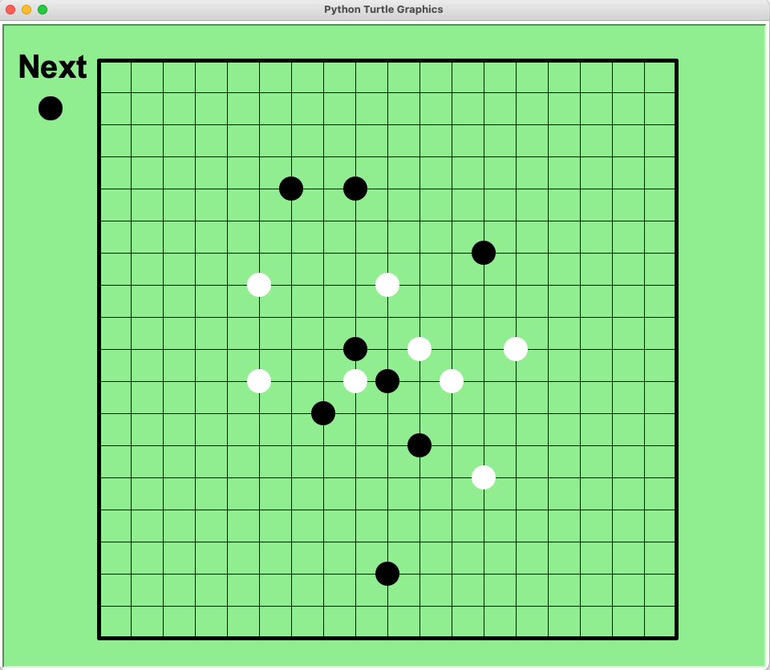
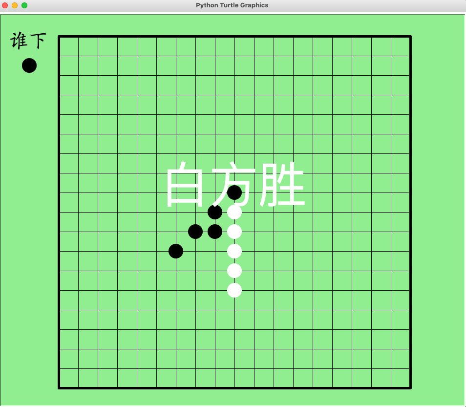

# 10 gobang

## Requirements

1. Run the code in console using command line.
2. It'll open a Python window to let 2 players play gobang game.

## What will we practice in this project?

- turtle draw
- mouse click event handle
- 2d array
- list
- exception handle
- function

## A reference code

```python
from turtle import *

win = False

speed(0)
bgcolor("lightgreen")
yanse="black"
gz=40

judge = Turtle()
judge.up()
judge.goto(-460, 330)
judge.write("Next", font=("Arial", 40, "bold"))
judge.color(yanse)
judge.goto(-420, 300)
judge.dot(30)

for i in range(19):
    up()
    goto(-gz*9, gz*(9-i))
    down()
    fd(gz*18)
    bk(gz*18)

rt(90)

for i in range(19):
    up()
    goto(-gz*(9-i), gz*9)
    down()
    fd(gz*18)
    bk(gz*18)

pensize(5)
for i in range(4):
    fd(gz*18)
    rt(90)

# m = [[0] * 19 for i in range(19)]
m =[
    [0,0,0,0,0,0,0,0,0,0,0,0,0,0,0,0,0,0,0],
    [0,0,0,0,0,0,0,0,0,0,0,0,0,0,0,0,0,0,0],
    [0,0,0,0,0,0,0,0,0,0,0,0,0,0,0,0,0,0,0],
    [0,0,0,0,0,0,0,0,0,0,0,0,0,0,0,0,0,0,0],
    [0,0,0,0,0,0,0,0,0,0,0,0,0,0,0,0,0,0,0],
    [0,0,0,0,0,0,0,0,0,0,0,0,0,0,0,0,0,0,0],
    [0,0,0,0,0,0,0,0,0,0,0,0,0,0,0,0,0,0,0],
    [0,0,0,0,0,0,0,0,0,0,0,0,0,0,0,0,0,0,0],
    [0,0,0,0,0,0,0,0,0,0,0,0,0,0,0,0,0,0,0],
    [0,0,0,0,0,0,0,0,0,0,0,0,0,0,0,0,0,0,0],
    [0,0,0,0,0,0,0,0,0,0,0,0,0,0,0,0,0,0,0],
    [0,0,0,0,0,0,0,0,0,0,0,0,0,0,0,0,0,0,0],
    [0,0,0,0,0,0,0,0,0,0,0,0,0,0,0,0,0,0,0],
    [0,0,0,0,0,0,0,0,0,0,0,0,0,0,0,0,0,0,0],
    [0,0,0,0,0,0,0,0,0,0,0,0,0,0,0,0,0,0,0],
    [0,0,0,0,0,0,0,0,0,0,0,0,0,0,0,0,0,0,0],
    [0,0,0,0,0,0,0,0,0,0,0,0,0,0,0,0,0,0,0],
    [0,0,0,0,0,0,0,0,0,0,0,0,0,0,0,0,0,0,0],
    [0,0,0,0,0,0,0,0,0,0,0,0,0,0,0,0,0,0,0]
]

def check(i, j):
    global win
    g = [0] * 8
    fw = ((0, 1), (1, 1), (1, 0), (1, -1), (0, -1), (-1, -1), (-1, 0), (-1, 1))
    for index in range(8):
        d = fw[index]
        next_i = i + d[0]
        next_j = j + d[1]
        while next_i in range(19) and next_j in range(19) and m[next_i][next_j] == m[i][j]:
            g[index] = g[index] + 1
            next_i = next_i + d[0]
            next_j = next_j + d[1]
    
    for index in range(4):
        if g[index] + g[index + 4] + 1 >= 5:
            win = True
            goto(0, 0)
            if yanse == "black":
                write('Black Win', font=('Arial', 100, ''), align='center')
            else:
                write('White Win', font=('Arial', 100, ''), align='center')
            break

def play(x, y):
    if not win:
        global yanse
        global gz
        color(yanse)
        up()
        x = round(x/gz)*gz
        y = round(y/gz)*gz
        i = int(9 - y / gz)
        j = int(x / gz + 9)
        
        if i >= 0 and i <= 18 and j >=0 and j<=18:
            if m[i][j] == 0:
                goto(x, y) 
                dot(30)
                
                if yanse == "black":
                    m[i][j] = 1
                    check(i, j)
                    yanse="white"
                else:
                    m[i][j] = 2
                    check(i, j)
                    yanse="black"
                    
                judge.color(yanse)
                judge.dot(30)
                
onscreenclick(play, 1)
done()

```

## Run the demo

Please save the Python as gobang.py and run it in console：

```
python gobang.py
```



----

# 1分钟数学运算

## 项目需求

- 直接在控制台使用命令行运行
- 运行之后出现五子棋小游戏

## 项目练习

- turtle工具包
- 自定义函数
- 二维列表
- 鼠标事件

## 项目参考代码

```python
# 导入turtle工具包
from turtle import *

# 输赢
win = False

# 最快速度
speed(0)
# 背景颜色
bgcolor("lightgreen")
# 颜色变量，默认是黑色
yanse="black"
# 格子大小
gz=40

judge = Turtle()
judge.up()
judge.goto(-460, 330)
judge.write("谁下", font=("Kai", 40, "bold"))
judge.color(yanse)
judge.goto(-420, 300)
judge.dot(30)

# 画19条横线
for i in range(19):
    up()
    goto(-gz*9, gz*(9-i))
    down()
    fd(gz*18)
    bk(gz*18)

rt(90)
# 画19条竖线
for i in range(19):
    up()
    goto(-gz*(9-i), gz*9)
    down()
    fd(gz*18)
    bk(gz*18)

# 画最外面的粗边框
pensize(5)
for i in range(4):
    fd(gz*18)
    rt(90)

# 2维列表，存储棋盘棋子数据，0表示没有棋子，1表示黑棋，2表示白棋
# m = [[0] * 19 for i in range(19)]
m =[
    [0,0,0,0,0,0,0,0,0,0,0,0,0,0,0,0,0,0,0],
    [0,0,0,0,0,0,0,0,0,0,0,0,0,0,0,0,0,0,0],
    [0,0,0,0,0,0,0,0,0,0,0,0,0,0,0,0,0,0,0],
    [0,0,0,0,0,0,0,0,0,0,0,0,0,0,0,0,0,0,0],
    [0,0,0,0,0,0,0,0,0,0,0,0,0,0,0,0,0,0,0],
    [0,0,0,0,0,0,0,0,0,0,0,0,0,0,0,0,0,0,0],
    [0,0,0,0,0,0,0,0,0,0,0,0,0,0,0,0,0,0,0],
    [0,0,0,0,0,0,0,0,0,0,0,0,0,0,0,0,0,0,0],
    [0,0,0,0,0,0,0,0,0,0,0,0,0,0,0,0,0,0,0],
    [0,0,0,0,0,0,0,0,0,0,0,0,0,0,0,0,0,0,0],
    [0,0,0,0,0,0,0,0,0,0,0,0,0,0,0,0,0,0,0],
    [0,0,0,0,0,0,0,0,0,0,0,0,0,0,0,0,0,0,0],
    [0,0,0,0,0,0,0,0,0,0,0,0,0,0,0,0,0,0,0],
    [0,0,0,0,0,0,0,0,0,0,0,0,0,0,0,0,0,0,0],
    [0,0,0,0,0,0,0,0,0,0,0,0,0,0,0,0,0,0,0],
    [0,0,0,0,0,0,0,0,0,0,0,0,0,0,0,0,0,0,0],
    [0,0,0,0,0,0,0,0,0,0,0,0,0,0,0,0,0,0,0],
    [0,0,0,0,0,0,0,0,0,0,0,0,0,0,0,0,0,0,0],
    [0,0,0,0,0,0,0,0,0,0,0,0,0,0,0,0,0,0,0]
]

# 判断输赢
def check(i, j):
    global win
    g = [0] * 8
    fw = ((0, 1), (1, 1), (1, 0), (1, -1), (0, -1), (-1, -1), (-1, 0), (-1, 1))
    for index in range(8):
        d = fw[index]
        next_i = i + d[0]
        next_j = j + d[1]
        while next_i in range(19) and next_j in range(19) and m[next_i][next_j] == m[i][j]:
            g[index] = g[index] + 1
            next_i = next_i + d[0]
            next_j = next_j + d[1]
    
    for index in range(4):
        if g[index] + g[index + 4] + 1 >= 5:
            win = True
            goto(0, 0)
            if yanse == "black":
                write('黑方胜', font=('', 100, ''), align='center')
            else:
                write('白方胜', font=('', 100, ''), align='center')
            break

# 放棋子的自定义函数
def play(x, y):
    if not win:
        global yanse
        global gz
        color(yanse)
        up()
        # x变成格子的整数倍，个位数上要进行4舍5入
        x = round(x/gz)*gz
        # y变成格子的整数倍，个位数上要进行4舍5入
        y = round(y/gz)*gz
        # 计算棋子在电脑中的位置
        i = int(9 - y / gz)
        j = int(x / gz + 9)
        
        # 只有棋子在棋盘范围内才可以下
        if i >= 0 and i <= 18 and j >=0 and j<=18:
            # 如果[i, j]没有棋子
            if m[i][j] == 0:
                goto(x, y) 
                dot(30)
                
                if yanse == "black":
                    m[i][j] = 1
                    # 判断输赢
                    check(i, j)
                    yanse="white"
                else:
                    m[i][j] = 2
                    # 判断输赢
                    check(i, j)
                    yanse="black"
                    
                # 裁判变色并重新画点
                judge.color(yanse)
                judge.dot(30)
    
# 当鼠标左键点击屏幕时执行放棋子的自定义函数
onscreenclick(play, 1)
done()

```

## 测试运行

将代码保存为gobang.py，然后在控制台运行：

```
python gobang.py
```

