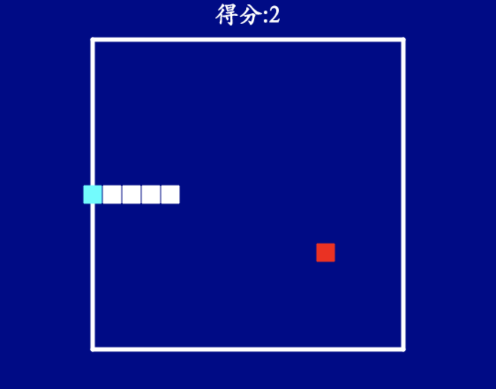

# 11 Snake game

## Requirements

1. Run the code in console using command line.
2. It'll open a Python window to play the snake game.

## What will we practice in this project?

- turtle diagram
- key event handle
- if condition
- timer
- object clone
- list

## A reference code

```python
from turtle import *
from random import randint

gz = 22
bc = gz * 8

screen = Screen()
screen.bgcolor("darkblue")

food = Turtle()
food.color("red")
food.shape("square")
food.up()
food.speed(0)
food.goto(randint(-bc+gz, bc-gz)//gz*gz, randint(-bc+gz, bc-gz)//gz*gz)

liner = Turtle()
liner.speed(0)
liner.up()
liner.goto(-bc, bc)
liner.color("white")
liner.pensize(5)
liner.down()
for i in range(4):
    liner.fd(bc*2)
    liner.rt(90)
liner.ht()

score = 0
judge = Turtle()
judge.speed(0)
judge.up()
judge.goto(0, bc+20)
judge.color("white")
judge.write("得分:{}".format(score), align="center", font=("Kai", 20, "bold"))
judge.ht()

head = Turtle()
head.speed(0)
head.up()
head.color("cyan")
head.shape("square")

snake = []
snake.append(head)
for i in range(2):
    body = head.clone()
    body.color("white")
    body.goto(head.xcor()+(i+1)*gz, head.ycor())
    snake.append(body)

d = [-1, 0]
def move():
    last = snake.pop()
    first = snake[0]
    first.color("white")
    last.goto(first.xcor() + d[0] * gz, first.ycor() + d[1] * gz)
    last.color("cyan")
    snake.insert(0, last)
    
    if snake[0].xcor() == food.xcor() and snake[0].ycor() == food.ycor():
        food.ht()
        food.goto(randint(-bc+gz, bc-gz)//gz*gz, randint(-bc+gz, bc-gz)//gz*gz)
        food.st()
        body = snake[-1].clone()
        snake.append(body)
        global score
        score += 1
        judge.clear()
        judge.write("得分:{}".format(score), align="center", font=("Kai", 20, "bold"))
    
    if (snake[0].xcor() > -bc and snake[0].xcor() < bc) and \
       (snake[0].ycor() > -bc and snake[0].ycor() < bc):
        screen.ontimer(move, 500)
        
def up():
    global d
    if d[1] != -1:
        d = [0, 1]
def down():
    global d
    if d[1] != 1:
        d = [0, -1]
def left():
    global d
    if d[0] != 1:
        d = [-1, 0]
def right():
    global d
    if d[0] != -1:
        d = [1, 0]

screen.onkey(up, "Up")
screen.onkey(down, "Down")
screen.onkey(left, "Left")
screen.onkey(right, "Right")

screen.listen()

move()

```

## Run the demo

Please save the Python as snake.py and run it in console：

```
python snake.py
```



----

# 贪吃蛇小游戏

## 项目需求

- 直接在控制台使用命令行运行
- 运行之后出现贪吃蛇小游戏

## 项目练习

- turtle
- 键盘事件响应
- 条件语句
- 定时器
- 对象克隆
- 列表

## 项目参考代码

```python
from turtle import *
from random import randint

gz = 22
bc = gz * 8

screen = Screen()
screen.bgcolor("darkblue")

food = Turtle()
food.color("red")
food.shape("square")
food.up()
food.speed(0)
food.goto(randint(-bc+gz, bc-gz)//gz*gz, randint(-bc+gz, bc-gz)//gz*gz)

liner = Turtle()
liner.speed(0)
liner.up()
liner.goto(-bc, bc)
liner.color("white")
liner.pensize(5)
liner.down()
for i in range(4):
    liner.fd(bc*2)
    liner.rt(90)
liner.ht()

score = 0
judge = Turtle()
judge.speed(0)
judge.up()
judge.goto(0, bc+20)
judge.color("white")
judge.write("得分:{}".format(score), align="center", font=("Kai", 20, "bold"))
judge.ht()

head = Turtle()
head.speed(0)
head.up()
head.color("cyan")
head.shape("square")

snake = []
snake.append(head)
for i in range(2):
    body = head.clone()
    body.color("white")
    body.goto(head.xcor()+(i+1)*gz, head.ycor())
    snake.append(body)

d = [-1, 0]
def move():
    last = snake.pop()
    first = snake[0]
    first.color("white")
    last.goto(first.xcor() + d[0] * gz, first.ycor() + d[1] * gz)
    last.color("cyan")
    snake.insert(0, last)
    
    if snake[0].xcor() == food.xcor() and snake[0].ycor() == food.ycor():
        food.ht()
        food.goto(randint(-bc+gz, bc-gz)//gz*gz, randint(-bc+gz, bc-gz)//gz*gz)
        food.st()
        body = snake[-1].clone()
        snake.append(body)
        global score
        score += 1
        judge.clear()
        judge.write("得分:{}".format(score), align="center", font=("Kai", 20, "bold"))
    
    if (snake[0].xcor() > -bc and snake[0].xcor() < bc) and \
       (snake[0].ycor() > -bc and snake[0].ycor() < bc):
        screen.ontimer(move, 500)
        
def up():
    global d
    if d[1] != -1:
        d = [0, 1]
def down():
    global d
    if d[1] != 1:
        d = [0, -1]
def left():
    global d
    if d[0] != 1:
        d = [-1, 0]
def right():
    global d
    if d[0] != -1:
        d = [1, 0]

screen.onkey(up, "Up")
screen.onkey(down, "Down")
screen.onkey(left, "Left")
screen.onkey(right, "Right")

screen.listen()

move()

```

## 测试运行

将代码保存为snake.py，然后在控制台运行：

```
python snake.py
```

