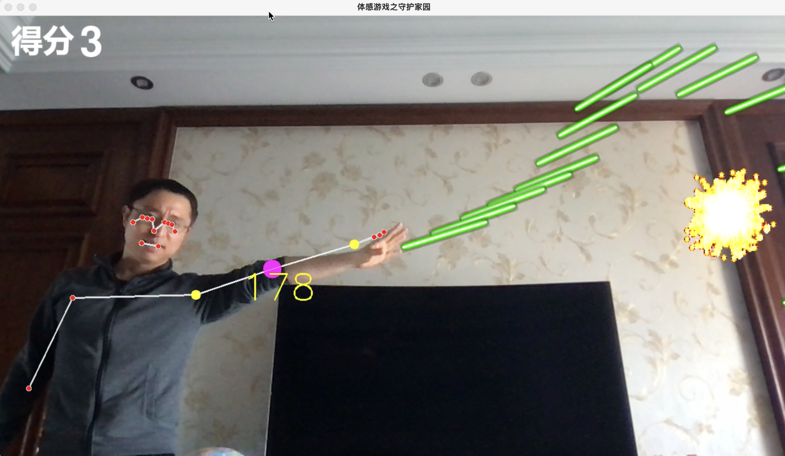

# 13 Pose game

## Requirements

1. Run the code in console using command line.
2. It'll open a Python window to play the pose game.

## What can we practice in this project?

- Pygame
- Pygame Zero lib
- OpenCV
- MediaPipe
- numpy
- Python while/for loop, if condition, list, etc.

## A reference code

```python
import cv2
import math
import numpy as np
import pgzrun
import pygame
from random import randint

from pose_util import PoseDetector
from utils import find_angle, is_touch

pd = PoseDetector()

camera = cv2.VideoCapture(0)
camera.set(cv2.CAP_PROP_FRAME_WIDTH, 1280)
camera.set(cv2.CAP_PROP_FRAME_HEIGHT, 720)

WIDTH = 1280
HEIGHT = 720
TITLE = "Python体感游戏：守护家园"

frame = None
score = Actor("score", (80, 50))
score.score = 0
covids = []
lasers = []


def generate_covid():
    covid = Actor("covid", (WIDTH, randint(0, HEIGHT)))
    covid.bombed = False
    covid.i = 1
    covids.append(covid)
    clock.schedule(generate_covid, randint(1, 3))


def pose_detect():
    global frame
    success, frame = camera.read()
    if success:
        frame = cv2.flip(frame, 1)
        pd.detect(frame, draw=False)
        angle = pd.get_angle(frame, 11, 13, 15, draw=False)
        if abs(angle) > 165 and abs(angle) < 190:
            x3, y3 = pd.positions[15][1], pd.positions[15][2]
            x2, y2 = pd.positions[13][1], pd.positions[13][2]
            x1, y1 = WIDTH, pd.positions[13][2]
            laser_angle = find_angle((x1, y1), (x2, y2), (x3, y3))
            laser = Actor("laser", (pd.positions[15][1], pd.positions[15][2]))
            laser.angle = laser_angle
            sounds.pew.play()
            lasers.append(laser)


def update_covids():
    for covid in covids:
        if covid.bombed == False and is_touch(covid, lasers):
            covid.bombed = True
            sounds.explode.play()
            score.score += 1
        if covid.bombed:
            if covid.i > 25:
                covid.i = 25
                covids.remove(covid)
            covid.image = "b_" + str(covid.i)
            covid.i += 1
        covid.x -= 1


def update_lasers():
    for laser in lasers:
        rad = math.radians(laser.angle)
        dx = 50 * math.cos(rad)
        dy = 50 * math.sin(rad)
        laser.x += dx
        laser.y -= dy


def update():
    pose_detect()
    update_covids()
    update_lasers()


def draw():
    global frame
    frame = cv2.cvtColor(frame, cv2.COLOR_BGR2RGB)
    frame = np.rot90(frame)
    frame = cv2.flip(frame, 0)
    frame = pygame.surfarray.make_surface(frame)
    screen.blit(frame, (0, 0))
    for covid in covids:
        covid.draw()
    for laser in lasers:
        laser.draw()
    score.draw()
    screen.draw.text(str(score.score), (150, 20), fontsize=100, color="white")


generate_covid()

pgzrun.go()

```

## Run the demo

Please save the Python as game.py and run it in console：

```
python game.py
```



----

# 体感游戏

## 项目需求

- 直接在控制台使用命令行运行
- 运行之后出现体感小游戏

## 项目练习

- Pygame
- Pygame Zero lib
- OpenCV
- MediaPipe
- numpy
- Python while/for loop, if condition, list, etc.

## 项目参考代码

- game.py 主程序
- pose_util.py 人体姿势识别模块
- utils.py 工具模块
- video.py 测试安装代码

## 测试运行

将代码保存为game.py，然后在控制台运行：

```
python game.py
```


