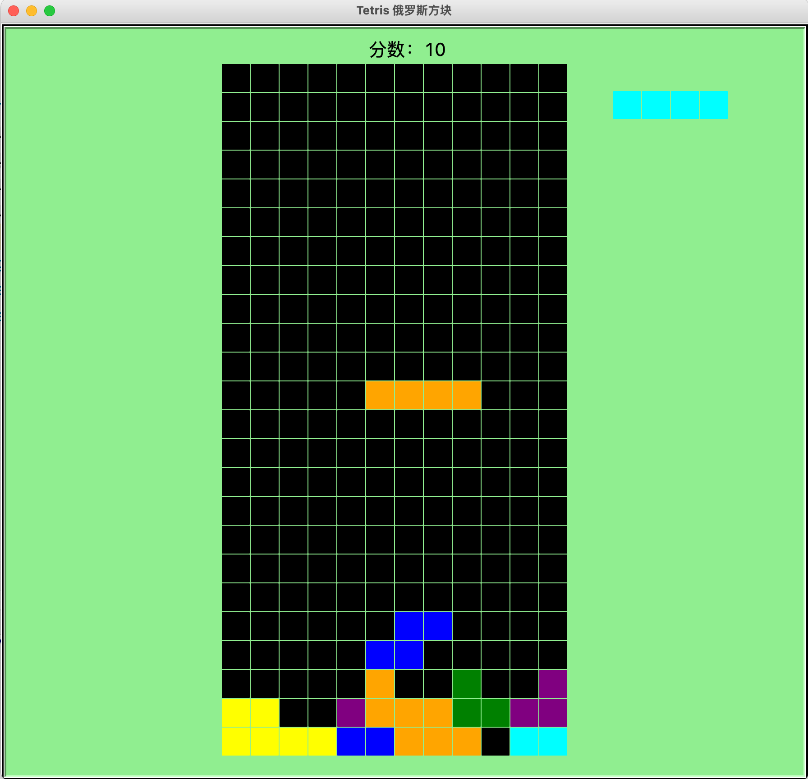

# 14 Tetris

## Requirements

1. Run the code in console using command line.
2. It'll open a Python window to play the Tetris game.

## What can we practice in this project?

- Turtle
- Class/Object
- 2D list

## A reference code

```python
from turtle import *
from random import randint, choice

SHAPES = [
    [[1, 1, 1, 1]],

    [[1],
     [1],
     [1],
     [1]],

    [[0, 0, 1],
     [1, 1, 1]],

    [[1, 0, 0],
     [1, 1, 1]],

    [[0, 1, 1],
     [1, 1, 0]],

    [[1, 1, 0],
     [0, 1, 1]],

    [[1, 1],
     [1, 1]],

    [[0, 1, 0],
     [1, 1, 1]]
]


class Block():
    def __init__(self, grid):
        """
        初始化
        :param grid: 游戏grid
        """
        self.grid = grid
        self.color = randint(1, 7)
        self.shape = choice(SHAPES)
        self.i = 0
        self.j = 5
        self.width = len(self.shape[0])
        self.height = len(self.shape)

    def fill(self):
        """
        将方块数据填充到grid中
        """
        for i in range(self.height):
            for j in range(self.width):
                if self.shape[i][j] == 1:
                    self.grid[self.i + i][self.j + j] = self.color

    def erase(self):
        """
        从grid中擦除方块
        """
        for i in range(self.height):
            for j in range(self.width):
                if self.shape[i][j] == 1:
                    self.grid[self.i + i][self.j + j] = 0

    def move_left(self):
        """
        向左移动一格
        """
        if self.j > 0:
            for row in range(self.height):
                for col in range(self.width):
                    if self.shape[row][col] == 1:
                        if self.grid[self.i + row][self.j + col - 1] != 0:
                            return False
                        break

            self.erase()
            self.j -= 1
            self.fill()

    def move_right(self):
        """
        向右移动一格
        """
        if self.j + self.width < len(self.grid[0]):
            for row in range(self.height):
                for col in range(self.width - 1, -1, -1):
                    if self.shape[row][col] == 1:
                        if self.grid[self.i + row][self.j + col + 1] != 0:
                            return False
                        break

            self.erase()
            self.j += 1
            self.fill()

    def move_down(self):
        """
        快速下移
        """
        i = self.i
        while self.check_down(i):
            i += 1
        self.erase()
        self.i = i
        self.fill()

    def check_down(self, i):
        """
        判断方块在i行时是否可以下落
        """
        if i + self.height >= len(self.grid):
            return False
        for col in range(self.width):
            for row in range(self.height - 1, -1, -1):
                if self.shape[row][col] == 1:
                    if self.grid[i + row + 1][self.j + col] != 0:
                        return False
                    break
        return True

    def can_fall(self):
        """
        判断方块是否可以下落
        """
        return self.check_down(self.i)

    def rotate(self):
        """
        旋转
        """
        rotated = []
        for j in range(len(self.shape[0])):
            new_row = []
            for i in range(len(self.shape) - 1, -1, -1):
                new_row.append(self.shape[i][j])
            rotated.append(new_row)

        for i in range(len(rotated)):
            for j in range(len(rotated[0])):
                if rotated[i][j] == 1:
                    # 如果旋转后，有任何位置超过边界，则不能旋转
                    if self.i + i >= len(self.grid) or self.j + j >= len(self.grid[0]):
                        return
                    # 如果旋转后的位置有方块了，则不能旋转
                    if self.grid[self.i + i][self.j + j] != 0 and (i not in range(len(self.shape)) or j not in range(
                            len(self.shape[0]))):
                        return
        self.erase()
        self.shape = rotated
        self.height = len(self.shape)
        self.width = len(self.shape[0])
        self.fill()


gz = 32
WIDTH = 12
HEIGHT = 24
COLORS = ("black", "red", "orange", "yellow", "green", "cyan", "blue", "purple")

grid = [[0 for col in range(WIDTH)] for row in range(HEIGHT)]

title("Tetris 俄罗斯方块")
bgcolor("lightgreen")
shapesize(1.5)
tracer(False)
speed(0)
shape("square")
up()

score = 0
score_pen = Turtle()
score_pen.ht()
score_pen.up()
score_pen.goto(0, HEIGHT / 2 * gz)
score_pen.down()
score_pen.write("分数：{}".format(score), font=("", 20, ""), align="center")

block_pen = Turtle()
block_pen.speed(0)
block_pen.shapesize(1.5)
block_pen.shape("square")
block_pen.up()
block_pen.ht()


def draw_next_block(block):
    block_pen.clear()
    block_pen.color(COLORS[block.color])
    for i in range(len(block.shape)):
        for j in range(len(block.shape[0])):
            if block.shape[i][j] == 1:
                block_pen.goto(WIDTH / 2 * gz + 50 + j * gz, HEIGHT / 2 * gz - 50 - i * gz)
                block_pen.stamp()


def draw_grid():
    clear()
    for row in range(len(grid)):
        for col in range(len(grid[row])):
            goto(-WIDTH / 2 * gz + col * gz, HEIGHT / 2 * gz - row * gz - 20)
            color(COLORS[grid[row][col]])
            stamp()


def check_grid():
    """
    检查是否要消除满格的行
    """
    global score
    for i in range(HEIGHT):
        is_full = True
        for j in range(WIDTH):
            if grid[i][j] == 0:
                is_full = False
                break
        if is_full:
            score += 10
            score_pen.clear()
            score_pen.write("分数：{}".format(score), font=("", 20, ""), align="center")
            grid.pop(i)
            grid.insert(0, [0 for x in range(WIDTH)])


blocks = []
block1 = Block(grid)
block2 = Block(grid)
blocks.append(block1)
blocks.append(block2)
draw_next_block(block2)


def left():
    blocks[0].move_left()


def right():
    blocks[0].move_right()


def down():
    blocks[0].move_down()


def rotate():
    blocks[0].rotate()


onkey(left, "Left")
onkey(right, "Right")
onkey(rotate, "Up")
onkey(down, "Down")
listen()


def run():
    b = blocks[0]
    if b.can_fall():
        b.erase()
        b.i += 1
        b.fill()
    else:
        if b.i == 0:
            b.fill()
            draw_grid()
            goto(0, 0)
            color("white")
            write("游戏结束", font=("", 50, ""), align="center")
            return
        check_grid()
        blocks.pop(0)
        block = Block(grid)
        blocks.append(block)
        draw_next_block(blocks[1])

    draw_grid()
    update()
    ontimer(run, 400)


run()
done()


```

## Run the demo

Please save the Python as game.py and run it in console：

```
python game.py
```



----

# 俄罗斯方块

## 项目需求

- 直接在控制台使用命令行运行
- 运行之后出现俄罗斯方块小游戏

## 项目练习

- Turtle
- Class/Object
- 2D list

## 项目参考代码

## 测试运行

将代码保存为game.py，然后在控制台运行：

```
python game.py
```


