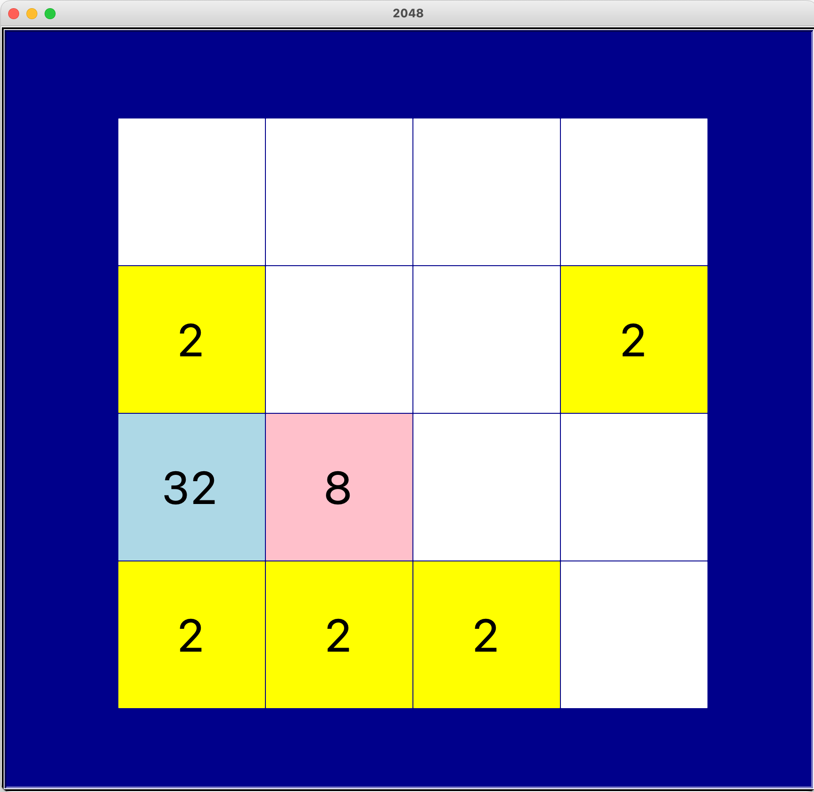

# 15 2048

## Requirements

1. Run the code in console using command line.
2. It'll open a Python window to play the 2048 game.

## What can we practice in this project?

- Turtle
- 2D List

## A reference code

```python
from turtle import *
from random import randint

title("2048")
gz = 176  # shapesize=8是连长160的正方形，我们可以将格子设置为162，这边就可以画出边框线
N = 4
bc = gz * N  # 边长
tracer(False)  # 不显示绘制动画
bgcolor("gray")
ht()
up()
speed(0)
shape("square")
shapesize(8)  # shapesize为8是一个连长为160的正方形

# 二维列表对应游戏表格
grid = [
    [0, 0, 0, 0],
    [0, 0, 0, 0],
    [0, 0, 0, 0],
    [0, 0, 0, 0]
]

maxx = 2
steps = 0
tj = Turtle()
tj.speed(0)
tj.up()
tj.ht()
tj.color("white")
tj.goto(-bc / 2, bc / 2 + 20)
tj.write("步数：{}，最大值：{}".format(steps, maxx), font=("", 20, ""))

# 颜色字典
COLORS = {
    0: "white",
    2: "yellow",
    4: "orange",
    8: "pink",
    16: "red",
    32: "lightblue",
    64: "lightgreen",
    128: "green",
    256: "purple",
    512: "cyan",
    1024: "silver",
    2048: "gold"
}


# 绘制二维列表
def draw_grid():
    global steps
    global maxx
    tj.clear()
    tj.write("步数：{}，最大值：{}".format(steps, maxx), font=("", 20, ""))
    steps += 1
    clear()
    for row in range(N):
        for col in range(N):
            # 从左上角(-bc/2 + gz/2， bc/2 - gz/2)开始从上往下、从左往右绘制
            goto(-bc / 2 + gz / 2 + col * gz, bc / 2 - gz / 2 - row * gz)
            # 根据grid[row][col]的数字，来设置对应的颜色
            color(COLORS[grid[row][col]])
            stamp()
            # 在单元格中写下对应的数字
            sety(bc / 2 - gz / 2 - row * gz - 30)
            color("black")
            if grid[row][col] > 0:
                write(grid[row][col], font=("", 50, ""), align="center")
            # 找最大值
            if grid[row][col] > maxx:
                maxx = grid[row][col]
    # 刷新游戏画面
    update()
    if maxx == 2048:
        goto(0, 0)
        color("red")
        write("游戏胜利", font=("", 100, ""), align="center")


def can_add():
    for i in range(N):
        for j in range(N):
            if grid[i][j] == 0:
                return True
    return False


def generate_random():
    # 如果能加
    if can_add():
        added = False
        # 随机选择一个空白位置，将这个位置数字设置为2
        while not added:
            i = randint(0, N - 1)
            j = randint(0, N - 1)
            if grid[i][j] == 0:
                grid[i][j] = 2
                added = True


generate_random()
draw_grid()


def up():
    # 每列
    for col in range(N):
        # 从第2行到最后一行
        for row in range(1, N):
            # 记下这个格子的数字
            value = grid[row][col]
            r = row
            # 找到最上面为0的格子r
            while r > 0 and grid[r - 1][col] == 0:
                r = r - 1
            # 如果r-1存在并且其中的数字和row数字一样，则将r变为r-1
            if r - 1 >= 0 and grid[r - 1][col] == value:
                r = r - 1
            # 如果r不等于原来的row，2者合并（此时r位置数字为0或者和row相等）
            if r != row:
                grid[r][col] += value
                grid[row][col] = 0  # 原来row的数字要变为0

    # 随机生成2
    generate_random()
    # 重新绘制格子
    draw_grid()


def down():
    for col in range(N):
        for row in range(N - 2, -1, -1):
            value = grid[row][col]
            r = row
            while r < N - 1 and grid[r + 1][col] == 0:
                r = r + 1
            if r + 1 < N and grid[r + 1][col] == value:
                r = r + 1
            if r != row:
                grid[r][col] += value
                grid[row][col] = 0
    generate_random()
    draw_grid()


def left():
    for row in range(N):
        for col in range(1, N):
            value = grid[row][col]
            c = col
            while c > 0 and grid[row][c - 1] == 0:
                c = c - 1
            if c - 1 >= 0 and grid[row][c - 1] == value:
                c = c - 1
            if c != col:
                grid[row][c] += value
                grid[row][col] = 0
    generate_random()
    draw_grid()


def right():
    for row in range(N):
        for col in range(N - 2, -1, -1):
            value = grid[row][col]
            c = col
            while c < N - 1 and grid[row][c + 1] == 0:
                c = c + 1
            if c + 1 < N and grid[row][c + 1] == value:
                c = c + 1
            if c != col:
                grid[row][c] += value
                grid[row][col] = 0
    generate_random()
    draw_grid()


onkeypress(up, "Up")  # 按向上键("Up")，执行up响应函数
onkeypress(down, "Down")  # 按向下键("Down")，执行down响应函数
onkeypress(left, "Left")  # 按向上键("Left")，执行left响应函数
onkeypress(right, "Right")  # 按向上键("Right")，执行right响应函数
listen()  # 开始监听

DONE()

```

## Run the demo

Please save the Python as game.py and run it in console：

```
python game.py
```



----

# 2048

## 项目需求

- 直接在控制台使用命令行运行
- 运行之后出现2048小游戏

## 项目练习

- Turtle
- Class/Object

## 项目参考代码

## 测试运行

将代码保存为game.py，然后在控制台运行：

```
python game.py
```


